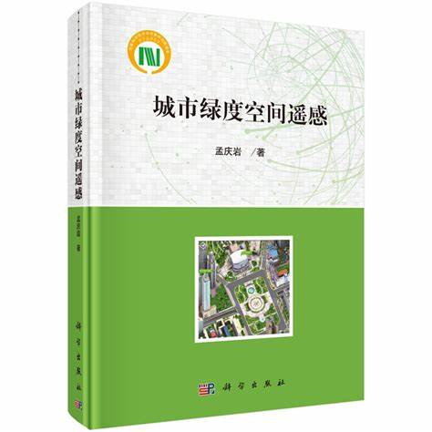
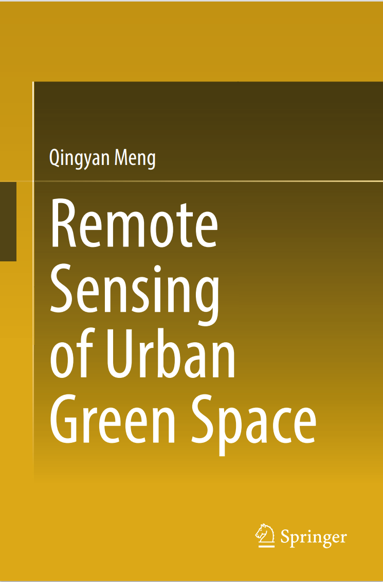
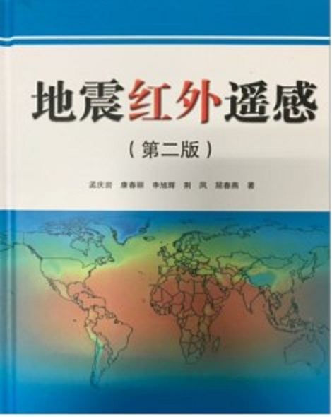
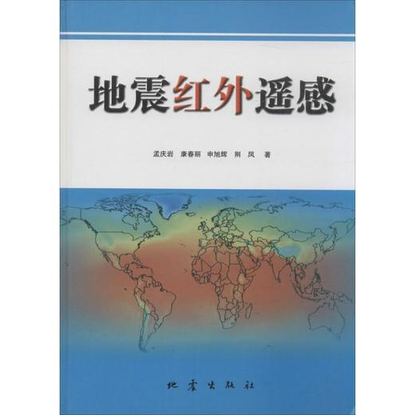
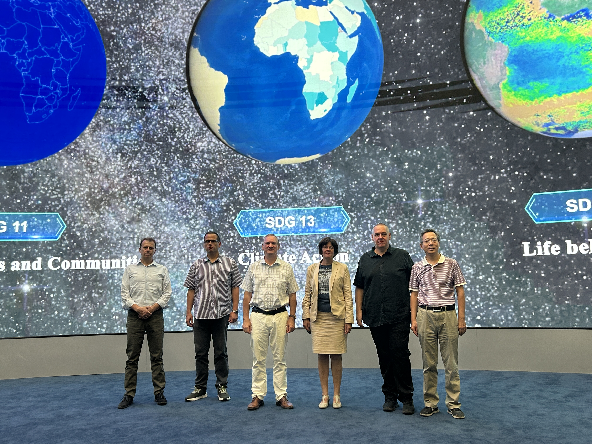
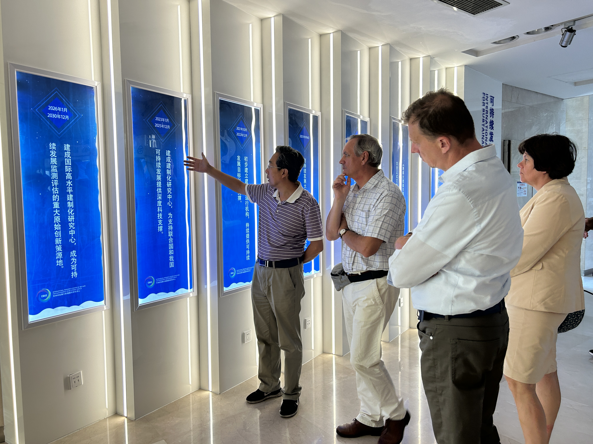

**Meng Qingyan**

Professor, Doctoral Supervisor, Institute of Remote Sensing and Digital Earth Chinese Academy of Sciences, Director of the research group for earth observation application systems engineering. In 2004, he was awarded the title of "Outstanding Youth of the Central State Organization".
His research interests are **urban environmental remote sensing** and seismic infrared remote sensing. International cooperation research with more than ten countries including France, Netherlands, Hungary, Russia, Bulgaria, Egypt, Israel, Japan, and Thailand. 
He has published 4 monographs, published more than **190 academic papers**, authorized and accepted 59 invention patents, and obtained 27 software copyrights, 19 awards. He has traveled to the United States, Switzerland, Hungary, Egypt and other countries for academic exchanges.
He provides courses on "Remote Sensing of Urban Environment" and "Remote Sensing Information Processing and Urban Application" at the University of Chinese Academy of Sciences. A training course on urban remote sensing was also organized for member countries of APSO and was included in the 10-year plan of APSO.

**[Detailed CV]**(https://q1310546582.github.io/MQY.github.io/cv/)

Contact Us
------

- Institute of Remote Sensing and Digital Earth, Chinese Academy of Sciences
- P.O. Box 9718, Datum Road No.3, Chao yang District, Beijing, China 100101 
- Mobile: +86-13911317962
- Phone: 86-10-64852195 (office)
- Fax:  86-10-64839949
- E-mail: mengqy@radi.ac.cn

# Recent publications

**2023**

1. [Anthropogenic heat variation during the COVID-19 pandemic control measures in four Chinese megacities](https://www.sciencedirect.com/science/article/pii/S0034425723001530). **Remote Sensing of Environment**, 2023.
2. [PanDiff: A Novel Pansharpening Method Based on Denoising Diffusion Probabilistic Model](https://ieeexplore.ieee.org/abstract/document/10136205). **IEEE Transactions on Geoscience and Remote Sensing**, 2023.
3. [A uniform methodology of local cooling and warming effects for different urban site types: multi-perspective assessment based on four northern Chinese cities](https://www.sciencedirect.com/science/article/abs/pii/S2210670723002639). **Sustainable Cities and Society**, 2023.
4. [Characteristics of anthropogenic heat with different modeling ideas and its driving effect on urban heat islands in seven typical Chinese cities](https://www.sciencedirect.com/science/article/abs/pii/S0048969723026104). **Science of The Total Environment**, 2023.
5. [Local and long-range collaborative learning for remote sensing scene classification](https://ieeexplore.ieee.org/abstract/document/10093899).**IEEE Transactions on Geoscience and Remote Sensing**, 2023. 
6. [A new 3D error diagram for a more balanced assessment of binary alarms for predicting earthquakes: Application to TIR anomalies in Sichuan area, China](https://ieeexplore.ieee.org/abstract/document/10175874). **IEEE Transactions on Geoscience and Remote Sensing**, 2023. 
7. [An Improved YOLOv5 Method to Detect Tailings Ponds from High-Resolution Remote Sensing Images](https://www.mdpi.com/2072-4292/15/7/1796). **Remote Sensing**, 2023.
8. [Evaluation of Fairness of Urban Park Green Space Based on an Improved Supply Model of Green Space: a Case Study of Bei-jing Central City](https://www.mdpi.com/2072-4292/15/1/244). **Remote Sensing**. 2023.
9. [Coarse-graining research of the thermal infrared anomalies before earthquakes in the Sichuan area on Google Earth engine](https://www.frontiersin.org/articles/10.3389/feart.2023.1101165/full). **Frontiers in Earth Science**, 2023.

**2022**

1. [Landscape and vegetation traits of urban green space can predict local surface temperature](https://www.sciencedirect.com/science/article/abs/pii/S0048969722010981). **Science of The Total Environment**, 2022.
2. [Relationships between Land Surface Temperatures and Neighboring Environment in Highly Urbanized Areas: Seasonal and Scale Effects Analyses of Beijing, China](https://www.mdpi.com/2072-4292/14/17/4340) **Remote Sensing**. 2022.
3. [Evaluation of Urban Spatial Structure from the Perspective of Socioeconomic Benefits Based on 3D Urban Landscape Measurements: A Case Study of Beijing, China](https://www.mdpi.com/2072-4292/14/21/5511). **Remote Sensing**. 2022.
4. [Application of 3D Error Diagram in Thermal Infrared Earthquake Prediction: Qinghai–Tibet Plateau](https://www.mdpi.com/2072-4292/14/23/5925). **Remote Sensing**, 2022.
5. [Contributing Factors and Trend Prediction of Urban-Settled Population Distribution Based on Human Perception Measurement: A Study on Beijing, China](https://www.mdpi.com/2072-4292/14/16/3965). **Remote Sens**. 2022.
6. [DSANet: A Deep Supervision-Based Simple Attention Network for Efficient Semantic Segmentation in Remote Sensing Imagery](https://www.mdpi.com/2072-4292/14/21/5399). **Remote Sensing**. 2022. 
7. [How does the ambient environment respond to the industrial heat island effects? An innovative and comprehensive methodological paradigm for quantifying the varied cooling effects of different landscapes](https://www.tandfonline.com/doi/full/10.1080/15481603.2022.2127463). **Giscience & Remote Sensing**, 2022.
8. [Multilayer Feature Fusion Network with Spatial Attention and Gated Mechanism for Remote Sensing Scene Classification](https://ieeexplore.ieee.org/abstract/document/9770786). **Geoscience and Remote Sensing Letters**.2022.
9. [NDBSI: A normalized difference bare soil index for remote sensing to improve bare soil mapping accuracy in urban and rural areas](https://www.sciencedirect.com/science/article/abs/pii/S034181622200251X). **Catena**.
10. [Improved anthropogenic heat flux model for fine spatiotemporal information in Southeast China](https://www.sciencedirect.com/science/article/abs/pii/S0269749122001312). **Environmental Pollution**.2022.

Recent reports 
======

**2023**

1. August 22, 2023, The 22nd China Remote Sensing Conference, Topic: Optimisation of Heat Emission Models in Urban My and Their Application in Epidemic Scenarios
2. July 14 2023, Intelligent Earth Lecture 256, Topic: [Spatial Remote Sensing of Urban Heat: The "Geometry" of Urban Fever](https://mp.weixin.qq.com/s/pcaTNcx6dlQbaNsOlsxVYQ)
3. July 13, 2023, The Third Space Information Technology Application Conference, Topic: Remote Sensing Technology and Application for Industrial Heat Pollution Detection
4. July 9, 2023, 5th Urban Remote Sensing Symposium, Topic: Optimisation of Urban Anthropogenic Heat Emission Models and Their Application to Epidemic Scenarios
5. July 1, 2023, China University of Mining and Technology (Beijing) Equivalent Doctoral Course, Topic: Remote Sensing of Urban Land Surface Environment
6. June 29, 2023, China Building Energy Conservation Society and China Remote Sensing Application Association, Forum on Intelligent Experience and Monitoring of Building Envelope, Topic: Remote Sensing Extraction of 3D Information from Urban Buildings and Monitoring Techniques of Anthropogenic Heat Emissions in Cities
7. June 3 2023, 2023 International Training Workshop on Earth Observations for Sustainable Development in Developing Countries, Online (Synchronous) webcast in Beijing-China & Kathmandu-Nepal & Matara-Sri Lanka), Urban Green Space Remote Sensing-----Multi-dimension and Multi-angle Perception of Urban Vegetation
8. May 9 2023, Liaocheng University, Shandong, Title: Remote Sensing of Urban Land Surface Environment - Making City Life Better
9. April 10, 2023, [Chinese Academy of Sciences, "Academic Salon Activity" Lecture, Topic: Application of Remote Sensing Technology in Optimising the Urban Environment](https://idea.cas.cn/viewconf.action?docid=84483#baogao1)
10. April 3, 2023, Peking University, Remote Sensing and Geomatics Lecture Series, No. 248, Topic: Spatial Remote Sensing Monitoring Techniques and Applications of Urban Heatiness

Publication of books 
======
1. **Remote Sensing of Urban Green Space (Chinese)**  
2. **Remote Sensing of Urban Green Space**  
3. **Earthquake Thermal Infrared Remote Sensing (The Second Edition)**  
4. **Earthquake Thermal Infrared Remote Sensing**  

Recent International Exchanges
======

**2023**

June 1-14, 2023, Hungary, China-Hungary Exchange Project. 
 

